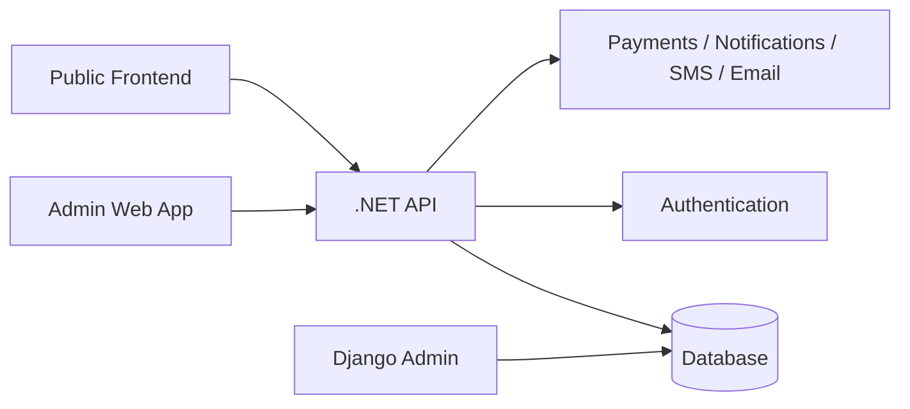

# CampusHostels Admin App Architecture

## Overview

This document defines a practical admin application architecture for CampusHostels to help manage customers, properties, tenancy, payments, bookings, and support operations.

The recommended approach is to keep the existing system architecture and build a dedicated admin dashboard on top of the current .NET API and shared database. This keeps the platform simple, scalable, and easier to maintain than creating a disconnected system.

---

## Recommended Solution

### 1. Keep a modular monolith architecture

Use a layered structure instead of building a complex microservice system too early:

- Frontend public site: React + Vite
- Admin frontend: React admin dashboard
- Backend: ASP.NET Core API
- Shared database: PostgreSQL in production, SQLite for local dev
- Django admin: optional internal or operational tool, not the main customer admin experience

This gives the project a strong foundation without unnecessary complexity.

---

## Overall System Design

### Why this design works

- The API remains the single source of truth for business rules.
- The admin app can manage operations without touching the database directly.
- The public frontend and admin frontend can both rely on the same backend and authentication model.
- New modules can be added without rewriting the whole stack.

---

## Admin App Responsibilities

The admin platform should cover these core operations:

### Customer management
- View customers and tenants
- Search by name, phone, email, unit, or status
- Manage customer profile information
- Track onboarding and verification status
- Handle customer support requests

### Property management
- Manage hostels and rooms
- Update occupancy status
- Track room availability
- Manage pricing and features
- Monitor property health and maintenance

### Booking and tenancy management
- View all bookings and agreements
- Approve or reject applications
- Update tenancy status
- Track move-in and move-out dates
- Manage lease documents

### Payment management
- View payment records
- Track pending, failed, and completed transactions
- Process refunds or adjustments
- Generate invoices and payment summaries
- Monitor financial performance

### Reporting and analytics
- Occupancy rates
- Monthly revenue
- Booking conversion rates
- Payment failures
- Customer churn and retention

### Support and communication
- Handle complaints and requests
- Send reminders and notices
- Log customer conversations and escalations
- Track resolution status

---

## Recommended Admin Modules

### Dashboard
- Key metrics overview
- Revenue trend
- Occupancy status
- Bookings by status
- Pending tasks

### Customers
- Customer list
- Customer detail view
- Profile editing
- Activity timeline
- Verification status

### Properties
- Hostel catalog
- Room inventory
- Availability tracking
- Pricing and features

### Tenancies
- Active leases
- Expiring contracts
- Renewals and term changes
- Move-in / move-out tracking

### Payments
- Payment table
- Payment filters
- Refund management
- Overdue payments

### Support
- Tickets
- Customer messages
- Escalations
- Internal notes

### Settings and access control
- Admin users
- Roles and permissions
- Approval workflows
- Audit logs

---

## Role-Based Access Control

Admin users should be separated by role and permission level:

### Roles
- Super Admin
- Operations Manager
- Finance Manager
- Support Agent
- Viewer / Read-only Staff

### Permissions example
- View customer records
- Edit customer profile
- Approve or reject tenancy
- Update payment status
- View financial reports
- Manage properties
- Manage system settings

This prevents unauthorized access and creates clear accountability.

---

## Authentication and Security

### Recommended flow

1. Staff logs into the admin app.
2. The frontend sends credentials to the .NET API.
3. The API validates the user and returns a JWT token.
4. The token is used on every protected request.
5. The API checks both role and permission before allowing access.

### Security best practices
- Use JWT access tokens and refresh tokens
- Store tokens securely in the browser
- Enforce HTTPS in production
- Restrict admin routes to authorized users only
- Add audit logging for all modifications
- Log payment, tenancy, and customer edits

---

## API Design for Admin Integration

The backend should expose a dedicated admin API area, for example:

- GET /api/admin/customers
- GET /api/admin/customers/{id}
- POST /api/admin/customers
- PUT /api/admin/customers/{id}
- DELETE /api/admin/customers/{id}
- GET /api/admin/properties
- GET /api/admin/tenancies
- GET /api/admin/payments
- GET /api/admin/reports/summary
- POST /api/admin/support/tickets

### Separation of concerns
- Public API: customer-facing operations
- Admin API: operations and internal management flows

This separation is important for security and maintainability.

---

## Frontend Admin App Structure

### Recommended layout

- Auth pages: login, forgot password
- Dashboard page
- Customers page
- Properties page
- Bookings page
- Tenancies page
- Payments page
- Reports page
- Support page
- User management page
- Settings page

### UI component recommendations
- Data tables with search and filtering
- Status badges
- Side navigation
- Charts and KPI cards
- Form modals for details and edits
- Activity feed for recent actions

---

## Data Model Recommendations

Core entities should remain shared across the platform:

- User / Customer
- Property
- Unit
- TenancyAgreement
- Payment
- Booking
- SupportTicket
- NotificationLog
- AuditLog

### Recommended admin-only records
- AdminUserRole
- AdminActivityLog
- PaymentAdjustment
- CustomerVerificationRecord
- NotificationTemplate

This creates a clean split between operational data and customer-facing logic.

---

## Integration Strategy

### Best integration pattern

The easiest and most stable path is:

- Keep all business logic in the .NET API
- Have the admin app call that API through well-defined endpoints
- Reuse the same database and authentication layer
- Avoid direct database calls from the frontend

### Benefits
- Easier to test
- Better security
- Simpler deployment
- Less duplicate logic
- Consistent data processing

---

## Suggested Architecture Summary

### Recommended final product structure

- Public website: React frontend for customer discovery and booking
- Admin app: React dashboard for operations and management
- Business layer: .NET API with services, DTOs, validators, and repositories
- Data layer: shared relational database
- Security: JWT + role-based authorization
- Internal tools: optional Django admin for selected operational tasks

This is the most practical, scalable, and easy-to-integrate architecture for your current project.

---

## Implementation Roadmap

### Phase 1
- Admin login
- Customer list and detail view
- Property and room overview
- Basic booking overview

### Phase 2
- Payment tracking
- Tenancy management
- Approval flows
- Notification and reminder features

### Phase 3
- Reports, dashboards, and analytics
- Support ticket management
- Audit logs and permissions

### Phase 4
- Advanced automation
- Export tools
- Staff workflows
- Customer segmentation and communication tools

---

## Recommended Improvements

Before treating this architecture as final, the following gaps should be addressed:

### 1. Resolve the Django admin database access conflict

The system diagram shows Django admin writing directly to the shared database, which contradicts the Integration Strategy principle of avoiding direct database access outside the .NET API. If Django admin can edit customers, payments, or tenancies directly, validation, audit logging, and business rules get bypassed for those changes. Pick one:

- Restrict Django admin to read-only/inspection use, or
- Route Django admin actions through the same .NET API, or
- Explicitly document which tables Django admin may touch directly and accept that those bypass business rules and audit logging.

### 2. Specify secure token storage

"Store tokens securely in the browser" is too vague for an app handling financial and customer PII. Use httpOnly, secure, SameSite cookies for the refresh token rather than localStorage or sessionStorage, to reduce exposure to XSS-based token theft.

### 3. Clarify the relationship between admin and public authentication

State explicitly whether admin users share the same identity system as public users with elevated claims, or are a separate user store. If shared, use policy-based authorization (claims/roles on the same JWT) to lock down `/api/admin/*` routes, and document that decision here.

### 4. Turn the RBAC list into a permission matrix

Roles and permissions are currently listed separately with no mapping between them. Before Phase 3 (Support/Settings), define an explicit role-to-permission matrix so access decisions (e.g. who can approve a tenancy) are enforced consistently in code rather than decided ad hoc.

---

## Final Recommendation

For CampusHostels, the best long-term architecture is a dedicated admin dashboard built on top of the existing .NET API and shared database, not a separate siloed application or a heavy microservice setup.

This keeps the platform easy to operate, easy to integrate, and scalable enough for growth.
